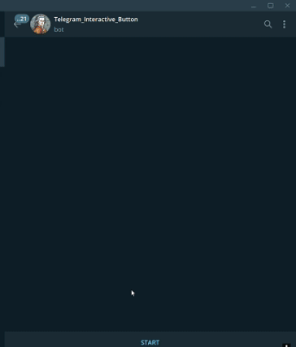

<div align="center">
    <h1 id="titulo">Telegram-Interactive-Button-Bot</h1>
    <p>A Telegram bot designed to offer interactive button functionalities, providing easy access to log queries, customizable commands, and more.</p>
</div>


## Table of Contents

1. [Overview](#overview)
2. [Installation](#installation)
3. [How to Use](#how-to-use)
4. [Examples](#examples)
5. [Contributing](#contributing)
6. [License](#license)

### Overview

This project is a customizable Telegram bot built with Python that allows users to interact via buttons to manage cloud logs, select subscription plans, and more. The bot is highly flexible, enabling easy modification for different features, commands, and interactions.

### Installation

1. Clone the repository:

    ```bash
   git clone https://github.com/MozzieGM/Telegram_Interactive_Button.git
2. Install the required dependencies:

    ```bash
    pip install -r requirements.txt
3. Set up your .env file with your Telegram API key:

    ```bash
    API_KEY=your_telegram_bot_api_key
4. Run the bot:

    ```bash
    python main.py

    
### How to Use

1. Start the bot by sending /start in your Telegram chat.
2. Use interactive buttons to explore different functionalities such as subscription plans, log queries, and bot information.
3. Customize commands and functionalities according to your needs by modifying the bot's code.

### Examples



### Contributing

Contributions are welcome! Open an issue for suggestions or submit a pull request with your improvements and changes.

### License

This project is licensed under the [MIT License](LICENSE).
